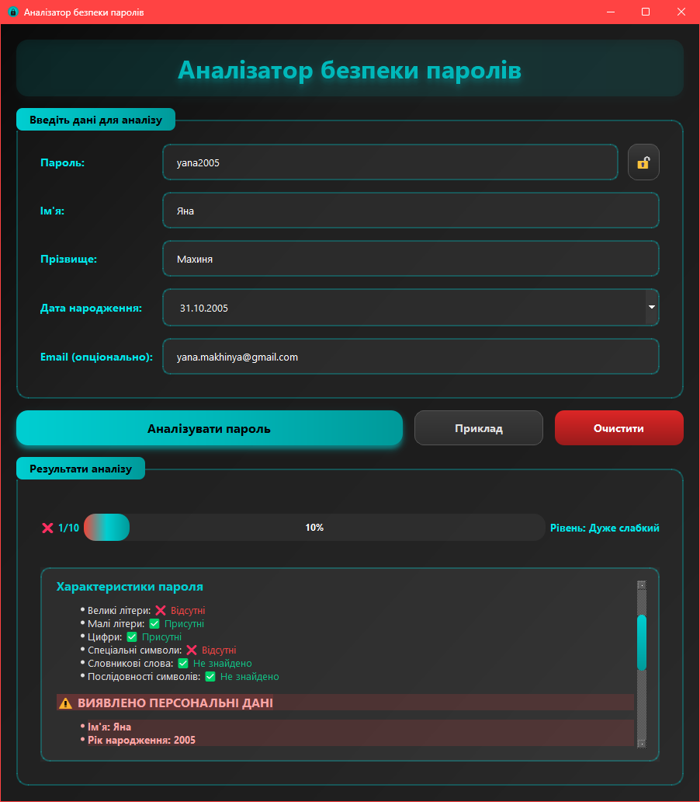
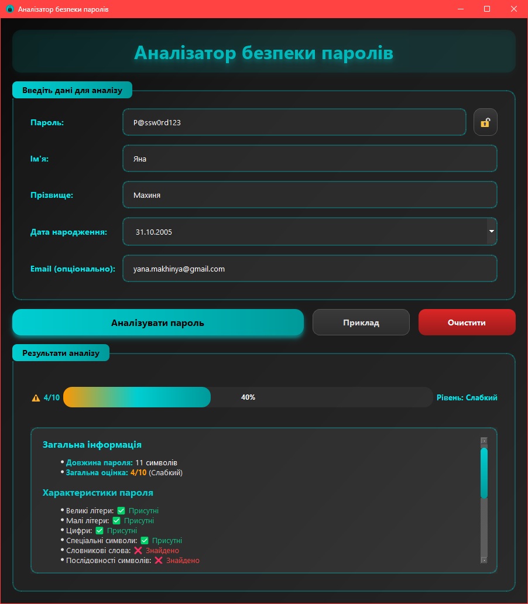
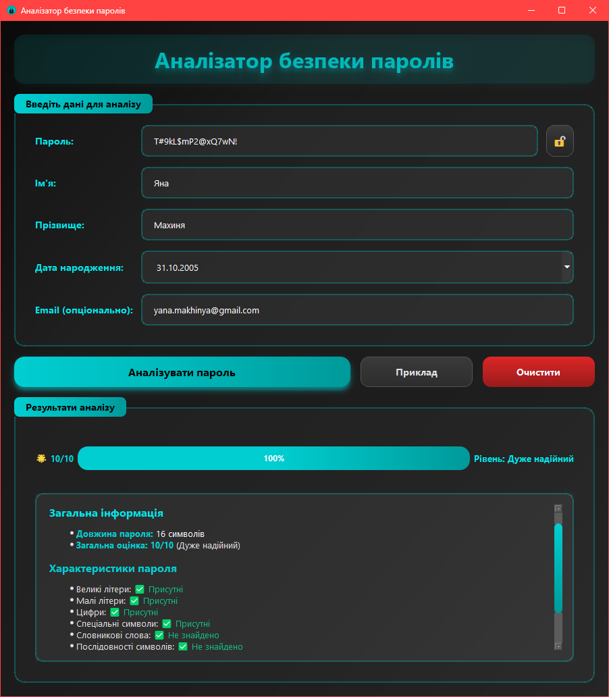

# Лабораторна робота №1: Аналізатор безпеки паролів

Десктопна програма на Qt для комплексного аналізу безпеки паролів з перевіркою на наявність персональних даних, словникових слів та оцінкою складності.

## Зміст

- [Опис програми](#опис-програми)
- [Функціональні можливості](#функціональні-можливості)
- [Вимоги до системи](#вимоги-до-системи)
- [Встановлення](#встановлення)
- [Інструкція користувача](#інструкція-користувача)
- [Архітектура програми](#архітектура-програми)
- [Скріншоти](#скріншоти)

## Опис програми

**Аналізатор безпеки паролів** — це настільний застосунок, розроблений на C++ з використанням фреймворку Qt, який виконує детальний аналіз паролів на безпеку та надає рекомендації щодо їх покращення.

### Основні можливості:

- Аналіз складності пароля (довжина, різноманітність символів).
- Виявлення персональних даних (ім'я, прізвище, дата народження, email).
- Перевірка на наявність поширених словникових слів.
- Виявлення послідовностей символів (123, abc, 987 тощо).
- Оцінка надійності від 1 до 10 балів.
- Детальні рекомендації для покращення безпеки.
- Сучасний темний інтерфейс.

## Функціональні можливості

### Критерії аналізу:

1. **Складність пароля:**
   - Довжина (мінімум 8 символів, рекомендовано 12+).
   - Наявність великих літер (A-Z, А-Я).
   - Наявність малих літер (a-z, а-я).
   - Наявність цифр (0-9).
   - Наявність спеціальних символів (!@#$%^&*).

2. **Персональні дані:**
   - Виявлення імені та прізвища (включаючи варіації регістру).
   - Перевірка дати народження (різні формати).
   - Виявлення року народження.
   - Перевірка email адреси.
   - Розпізнавання leetspeak заміни символів (0→o, 1→i, 3→e, @→a).

3. **Словникові атаки:**
   - База поширених паролів (password, qwerty, admin тощо).
   - Транслітерація українських слів.
   - Нормалізація тексту для порівняння.

4. **Послідовності:**
   - Числові послідовності (123, 456, 987).
   - Літерні послідовності латиниці (abc, xyz).
   - Літерні послідовності кирилиці (абв, яюї).
   - Зворотні послідовності.

### Система оцінювання:

- **1-3 бали**: Дуже слабкий пароль.
- **4-5 балів**: Слабкий пароль.
- **6-7 балів**: Середній пароль.
- **8 балів**: Надійний пароль.
- **9-10 балів**: Дуже надійний пароль.

## Вимоги до системи

### Мінімальні вимоги:

- **Операційна система:**
  - Windows 10/11.
  - Linux (Ubuntu 20.04+, Fedora 35+).
  - macOS 11+.

- **Програмне забезпечення:**
  - Qt 6.x або Qt 5.15+ (з модулями Core, GUI, Widgets).
  - Компілятор C++17 (GCC 8+, Clang 7+, MSVC 2019+).
  - CMake 3.16+ або qmake.

- **Апаратні вимоги:**
  - Процесор: 1 GHz.
  - ОЗП: 256 MB.
  - Вільне місце на диску: 50 MB.

## Встановлення

### Крок 1: Встановлення Qt.

#### Linux (Ubuntu/Debian):
```bash
sudo apt update
sudo apt install qt6-base-dev qt6-tools-dev build-essential
```

#### Linux (Fedora):
```bash
sudo dnf install qt6-qtbase-devel qt6-qttools-devel gcc-c++
```

#### Windows:
1. Завантажте Qt Online Installer з [qt.io/download](https://www.qt.io/download).
2. Встановіть Qt 6.x з компонентом "Desktop gcc" або "MSVC".
3. Додайте шлях до `bin` директорії Qt у змінну PATH.

#### macOS:
```bash
brew install qt@6
```

### Крок 2: Завантаження проєкту.

```bash
unzip lab01.zip
cd lab01
```

### Крок 3: Збірка та запуск проєкту.

1. Запустіть Qt Creator.
2. Відкрийте файл `lab01.pro` (File → Open File or Project).
3. Виберіть комплект (kit) для збірки.
4. Натисніть кнопку "Configure Project".
5. Натисніть ▶️ (Run) або Ctrl+R.

## Інструкція користувача

### Основні кроки роботи:

1. **Запуск програми**
   - Запустіть виконуваний файл `lab01` / `lab01.exe`.
   - Відкриється головне вікно програми.

2. **Заповнення форми**
   
   **Обов'язкові поля:**
   - **Пароль**: введіть пароль для аналізу.
   - **Ім'я**: введіть ім'я користувача.
   - **Прізвище**: введіть прізвище користувача.
   - **Дата народження**: виберіть дату у календарі.
   
   **Опціональні поля:**
   - **Email**: введіть email адресу (не обов'язково).

3. **Використання кнопки "Приклад"**
   - Натисніть кнопку "Приклад" для автоматичного заповнення полів тестовими даними.
   - Це корисно для швидкого тестування функціоналу.

4. **Аналіз пароля**
   - Натисніть кнопку "Аналізувати пароль".
   - Програма виконає комплексний аналіз та відобразить результати.

5. **Перегляд результатів**
   
   Звіт містить:
   - **Загальну оцінку** (1-10 балів) з кольоровим індикатором.
   - **Довжину пароля** та рівень надійності.
   - **Характеристики**: наявність різних типів символів.
   - **Виявлені персональні дані** (якщо знайдено).
   - **Детальні рекомендації** для покращення безпеки.
   - **Приклади надійних паролів** (для слабких паролів).

6. **Очищення форми**
   - Натисніть кнопку "Очистити" для скидання всіх полів.

## Архітектура програми

### Структура проєкту:

```
lab01/Password Security Analyzer/
|    ├── Main.cpp                  # Точка входу в програму.
|    ├── MainWindow.h              # Заголовочний файл головного вікна.
|    ├── MainWindow.cpp            # Реалізація головного вікна.
|    ├── PasswordAnalyzer.h        # Заголовочний файл аналізатора.
|    ├── PasswordAnalyzer.cpp      # Реалізація логіки аналізу.
|    ├── ReportGenerator.h         # Заголовочний файл генератора звітів.
|    ├── ReportGenerator.cpp       # Реалізація HTML-звітів.
|    ├── UIStyleManager.h          # Заголовочний файл менеджера стилів.
|    ├── UIStyleManager.cpp        # Реалізація CSS-стилів.
|    ├── IconGenerator.h           # Заголовочний файл генератора іконок.
|    ├── IconGenerator.cpp         # Реалізація програмної іконки.
|    └── lab01.pro                 # Файл проєкту Qt (qmake).
└── README.md                 # Цей файл.
```

### Модулі програми:

1. **Main.cpp**
   - Точка входу в програму.
   - Ініціалізація QApplication.
   - Встановлення української локалі.

2. **MainWindow (MainWindow.h/cpp)**
   - Головне вікно програми.
   - Управління UI елементами.
   - Обробка подій користувача.
   - Відображення результатів аналізу.

3. **PasswordAnalyzer (PasswordAnalyzer.h/cpp)**
   - Ядро логіки аналізу паролів.
   - Перевірка складності.
   - Виявлення персональних даних.
   - Виявлення словникових слів.
   - Виявлення послідовностей.
   - Генерація рекомендацій.

4. **ReportGenerator (ReportGenerator.h/cpp)**
   - Генерація HTML-звітів.
   - Форматування результатів аналізу.
   - Створення структурованих секцій.

5. **UIStyleManager (UIStyleManager.h/cpp)**
   - Централізоване управління стилями.
   - CSS для всіх UI елементів.
   - Кольорова схема програми.

6. **IconGenerator (IconGenerator.h/cpp)**
   - Програмне створення іконки.
   - Генерація зображення замка.
   - Використання QPainter та градієнтів.

### Принципи проєктування:

- **Розділення відповідальностей (SRP)**: кожен клас відповідає за одну область.
- **Модульність**: легко змінювати та тестувати окремі компоненти.
- **Чистий код**: детальні коментарі, зрозумілі назви змінних.
- **MVC-подібна архітектура**: розділення логіки, даних та представлення.

## Скріншоти

### Результат аналізу слабкого пароля.



### Результат аналізу пароля із leetspeak.



### Результат аналізу надійного пароля.



---

## Технічні деталі

### Використані технології:

- **Мова програмування**: C++17.
- **GUI фреймворк**: Qt 6.x (Core, GUI, Widgets).
- **Система збірки**: qmake / CMake.

### Особливості реалізації:

1. **Алгоритм leetspeak**: нормалізація з заміною схожих символів.
2. **Транслітерація**: конвертація української кирилиці в латиницю.
3. **Регулярні вирази**: для пошуку дат у різних форматах.
4. **Градієнти**: використання QRadialGradient для іконки.
5. **Responsive UI**: адаптивний інтерфейс з прогрес-баром.

## Відомі обмеження

- Словник містить обмежену кількість поширених паролів (можна розширити).
- Не підтримується аналіз паролів з емоджі та екзотичними Unicode символами.
- Транслітерація підтримує лише українську мову.
