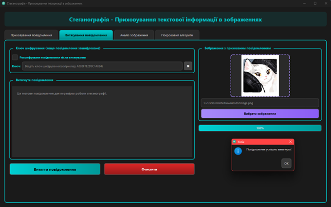
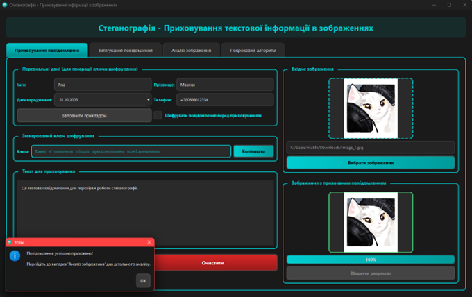
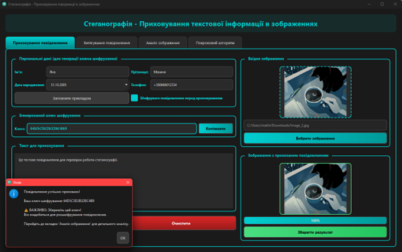
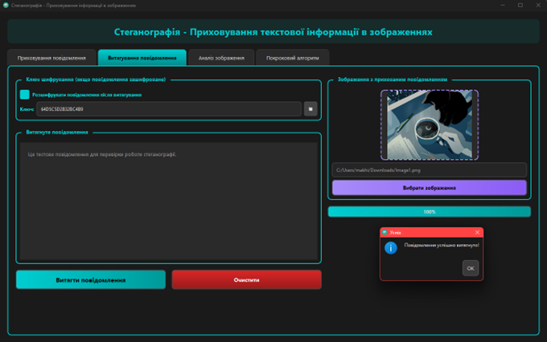
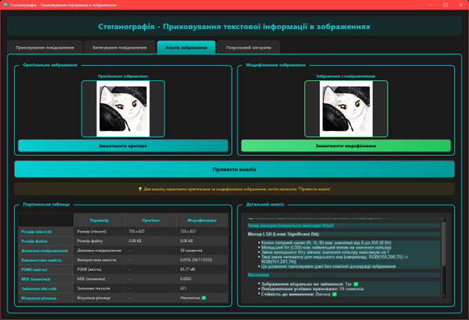
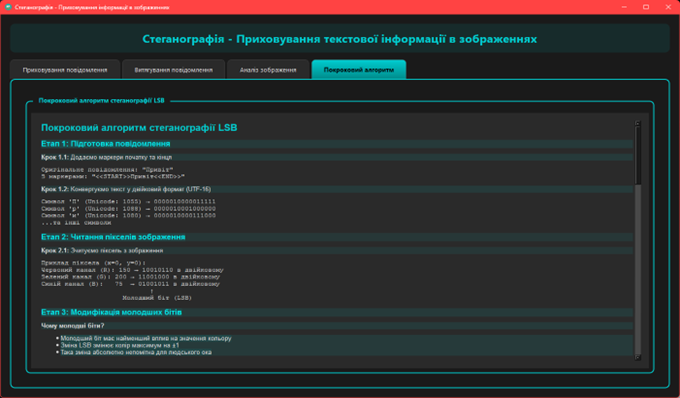

# Лабораторна робота №3: Стеганографія

Десктопна програма на Qt для приховування та витягування текстової інформації в зображеннях з використанням методу LSB (Least Significant Bit) та XOR-шифрування.

## Зміст

- [Опис програми](#опис-програми)
- [Функціональні можливості](#функціональні-можливості)
- [Вимоги до системи](#вимоги-до-системи)
- [Встановлення](#встановлення)
- [Інструкція користувача](#інструкція-користувача)
- [Архітектура програми](#архітектура-програми)
- [Скріншоти](#скріншоти)

## Опис програми

**Стеганографія** — це настільний застосунок, розроблений на C++ з використанням фреймворку Qt, який дозволяє приховувати текстові повідомлення всередині зображень методом LSB.

### Основні можливості:

- Приховування текстових повідомлень у зображеннях (PNG, JPG, BMP).
- Витягування прихованих повідомлень з зображень.
- XOR-шифрування для додаткового захисту.
- Генерація ключів з персональних даних (ім'я, прізвище, дата, телефон).
- Детальний аналіз якості стеганографії (PSNR, MSE).
- Покрокове пояснення алгоритму LSB.
- Візуальне порівняння оригіналу та модифікованого зображення.
- Сучасний темний інтерфейс.

## Функціональні можливості

### 1. Приховування повідомлень

- Метод LSB (Least Significant Bit) для заміни молодших бітів RGB-каналів.
- XOR-шифрування повідомлення перед приховуванням.
- Генерація ключа з персональних даних через SHA-256.
- Автоматичні маркери початку та кінця повідомлення (`<<START>>`, `<<END>>`).
- Розрахунок максимальної ємності зображення.

### 2. Витягування повідомлень

- Автоматичне декодування з пошуком маркерів.
- Опціональне дешифрування з правильним ключем.
- Підтримка введення ключа вручну.
- Перевірка наявності прихованого повідомлення.

### 3. Аналіз зображення

- **PSNR (Peak Signal-to-Noise Ratio)**: показує якість стеганографії.
- **MSE (Mean Squared Error)**: середньоквадратична помилка.
- **Змінені пікселі**: кількість модифікованих пікселів.
- **Використання ємності**: відсоток використаного простору.
- Порівняльна таблиця оригіналу та модифікованого зображення.

### 4. Покроковий алгоритм

- Детальне пояснення методу LSB.
- Приклади з конкретними числами.
- Математичні формули PSNR та MSE.
- Візуалізація процесу приховування.

## Вимоги до системи

### Мінімальні вимоги:

- **Операційна система:**
  - Windows 10/11.
  - Linux (Ubuntu 20.04+, Fedora 35+).
  - macOS 11+.

- **Програмне забезпечення:**
  - Qt 6.x або Qt 5.15+ (з модулями Core, GUI, Widgets).
  - Компілятор C++17 (GCC 8+, Clang 7+, MSVC 2019+).
  - CMake 3.16+ або qmake.

- **Апаратні вимоги:**
  - Процесор: 1 GHz.
  - ОЗП: 512 MB.
  - Вільне місце на диску: 100 MB.

## Встановлення

### Крок 1: Встановлення Qt.

#### Linux (Ubuntu/Debian):
```bash
sudo apt update
sudo apt install qt6-base-dev qt6-tools-dev build-essential
```

#### Linux (Fedora):
```bash
sudo dnf install qt6-qtbase-devel qt6-qttools-devel gcc-c++
```

#### Windows:
1. Завантажте Qt Online Installer з [qt.io/download](https://www.qt.io/download).
2. Встановіть Qt 6.x з компонентом "Desktop gcc" або "MSVC".
3. Додайте шлях до `bin` директорії Qt у змінну PATH.

#### macOS:
```bash
brew install qt@6
```

### Крок 2: Завантаження проєкту.

```bash
unzip lab03.zip
cd lab03
```

### Крок 3: Збірка та запуск проєкту.

1. Запустіть Qt Creator.
2. Відкрийте файл `lab03.pro` (File → Open File or Project).
3. Виберіть комплект (kit) для збірки.
4. Натисніть кнопку "Configure Project".
5. Натисніть ▶️ (Run) або Ctrl+R.

## Інструкція користувача

Програма має 4 основні вкладки для різних завдань стеганографії.

### Вкладка 1: Приховування повідомлення

1. **Заповнення персональних даних (опціонально)**
   - **Ім'я**: введіть ваше ім'я.
   - **Прізвище**: введіть ваше прізвище.
   - **Дата народження**: виберіть дату у календарі.
   - **Телефон**: введіть номер телефону.
   
   **Підказка:** Натисніть кнопку "Приклад персональних даних" для автозаповнення.

2. **Введення повідомлення**
   - У текстове поле введіть ваше секретне повідомлення.
   - Повідомлення може містити українські та англійські літери, цифри, спеціальні символи.

3. **Вибір зображення**
   - Натисніть кнопку "Вибрати зображення".
   - Виберіть файл зображення (PNG, JPG, BMP).
   - Переконайтеся, що зображення достатньо велике для вашого повідомлення.

   **Розрахунок ємності:**
   ```
   Максимальна довжина (символів) = (ширина × висота × 3) / 16 - маркери.
   Приклад: зображення 640×480 може вмістити ~57,600 символів.
   ```

4. **Налаштування шифрування (опціонально)**
   - Поставте галочку "Шифрувати повідомлення".
   - Програма автоматично згенерує ключ з ваших персональних даних.
   - Збережіть відображений ключ - він знадобиться для витягування.

   **ВАЖЛИВО:** Без правильного ключа витягнути повідомлення буде неможливо!

5. **Приховування**
   - Натисніть кнопку "Приховати повідомлення".
   - Дочекайтеся завершення процесу (прогрес-бар).
   - Перегляньте результат справа.
   - Збережіть модифіковане зображення (правою кнопкою → "Зберегти як...").

### Вкладка 2: Витягування повідомлення

1. **Вибір зображення з повідомленням**
   - Натисніть кнопку "Вибрати зображення".
   - Виберіть зображення, в якому приховано повідомлення.

2. **Налаштування дешифрування (якщо потрібно)**
   - Поставте галочку "Розшифрувати повідомлення".
   - Введіть ключ дешифрування в поле "Ключ".
   - Ключ має бути таким самим, як при приховуванні.

3. **Витягування**
   - Натисніть кнопку "Витягти повідомлення".
   - Дочекайтеся завершення процесу.
   - Повідомлення з'явиться в правій частині вікна.

### Вкладка 3: Аналіз зображення

Ця вкладка автоматично активується після приховування повідомлення.

**Порівняльна таблиця:**

| Параметр              | Оригінал | Модифікований |
|-----------------------|----------|---------------|
| Розмір зображення     | Ш × В px | Ш × В px      |
| Розмір файлу          | KB       | KB            |
| Довжина повідомлення  | -        | символів      |
| Використані біти      | -        | біт           |
| Використання ємності  | -        | %             |

**Метрики якості:**

- **PSNR (дБ)**: показник якості стеганографії.
  - 30-40 дБ: добре.
  - 40-50 дБ: відмінно.
  - 50+ дБ: ідеально.
  
- **MSE**: середньоквадратична помилка (чим менше, тим краще).

- **Змінені пікселі**: кількість модифікованих пікселів.

### Вкладка 4: Покроковий алгоритм

Навчальна секція з детальним поясненням методу LSB.

**Що включає:**
- Пояснення молодшого біту (Least Significant Bit).
- Покроковий процес приховування з прикладами.
- Приклад з конкретними числами:
  ```
  Оригінальний піксель RGB: (255, 128, 64)
  Біти для приховування: 1, 0, 1
  
  R = 255 (11111111) → встановлюємо LSB = 1 → 255 (11111111)
  G = 128 (10000000) → встановлюємо LSB = 0 → 128 (10000000)
  B = 64  (01000000) → встановлюємо LSB = 1 → 65  (01000001)
  
  Результат: (255, 128, 65) - зміна непомітна!
  ```
- Формули розрахунку PSNR та MSE.

### Додаткові функції

- **Кнопка "Очистити"**: очищує всі поля та зображення.
- **Копіювання ключа**: клацніть на поле з ключем і натисніть Ctrl+C.
- **Збереження результатів**: правою кнопкою на зображенні → "Зберегти як...".

### Поради та рекомендації

**Вибір зображення:**
- Використовуйте зображення з багатьма деталями.
- Уникайте однотонних фонів.
- Рекомендований розмір: 800×600 або більше.

**Формат файлу:**
- **PNG**: найкращий вибір (без втрат).
- **BMP**: також без втрат, але великий розмір.
- **JPG**: НЕ рекомендується (стиснення з втратами).

**Безпека:**
- Не поширюйте ключ разом з зображенням.
- Видаляйте оригінали після передачі.

## Архітектура програми

### Структура проєкту:

```
lab03/Steganography/
│    ├── Main.cpp                           # Точка входу в програму.
│    ├── SteganographyEngine.h              # Заголовок движка стеганографії.
│    ├── SteganographyEngine.cpp            # Реалізація алгоритмів LSB.
│    ├── SteganographyWindow.h              # Заголовок головного вікна.
│    ├── SteganographyWindow.cpp            # Конструктор та базова ініціалізація.
│    ├── SteganographyWindow_UI.cpp         # Створення інтерфейсу (4 вкладки).
│    ├── SteganographyWindow_Slots.cpp      # Обробники подій (слоти).
│    ├── SteganographyWindow_Helpers.cpp    # Допоміжні методи та стилі.
│    └── lab03.pro                          # Файл проєкту Qt (qmake).
└── README.md                          # Цей файл.
```

### Модулі програми:

1. **Main.cpp**
   - Точка входу в програму.
   - Створення QApplication.
   - Запуск головного вікна.

2. **SteganographyEngine (SteganographyEngine.h/cpp)**
   - Ядро логіки стеганографії.
   - Реалізація алгоритму LSB.
   - XOR-шифрування та дешифрування.
   - Генерація ключів з персональних даних.
   - Розрахунок метрик якості (PSNR, MSE).

3. **SteganographyWindow (SteganographyWindow.h/cpp + 3 допоміжні файли)**
   - Головне вікно програми.
   - Управління UI елементами.
   - Обробка подій користувача (слоти).
   - Відображення результатів аналізу.
   - Застосування темної теми.

### Принципи проєктування:

- **Розділення відповідальностей (SRP)**: кожен клас відповідає за одну область.
- **Модульність**: UI розділений на окремі файли за функціоналом.
- **Інкапсуляція**: деталі алгоритму приховані в Engine.
- **Чистий код**: детальні коментарі, зрозумілі назви змінних.

## Скріншоти

### Вкладка "Приховування повідомлення".



### Вкладка "Витягування повідомлення".



### Вкладка "Приховування зашифрованого повідомлення".



### Вкладка "Витягування зашифрованого овідомлення".



### Вкладка "Аналіз зображення".



### Вкладка "Покроковий алгоритм".



---

## Технічні деталі

### Використані технології:

- **Мова програмування**: C++17.
- **GUI фреймворк**: Qt 6.x (Core, GUI, Widgets).
- **Система збірки**: qmake / CMake.
- **Криптографія**: QCryptographicHash (SHA-256).

### Особливості реалізації:

1. **Алгоритм LSB**: заміна молодших бітів RGB-каналів пікселів.
2. **XOR-шифрування**: симетричний шифр для базового захисту.
3. **SHA-256 хешування**: генерація ключів з персональних даних.
4. **Маркери повідомлення**: автоматичне додавання `<<START>>` та `<<END>>`.
5. **Метрики PSNR/MSE**: обчислення якості стеганографії.

## Відомі обмеження

- XOR-шифрування підходить тільки для базового захисту.
- JPG формат не рекомендується через стиснення з втратами.
- Деякі емоджі можуть не працювати коректно (Unicode > 16 біт).
- Редагування зображення після приховування пошкодить повідомлення.
