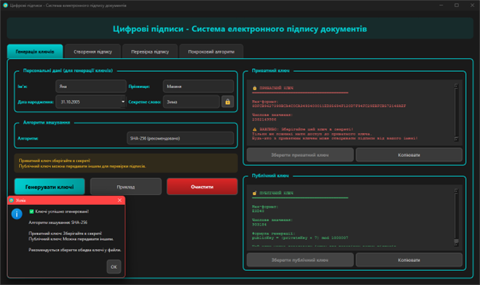
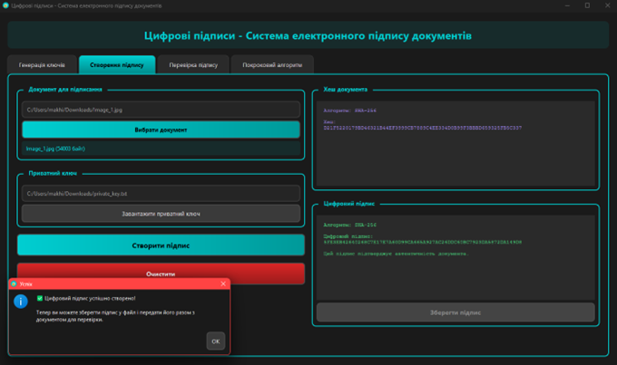
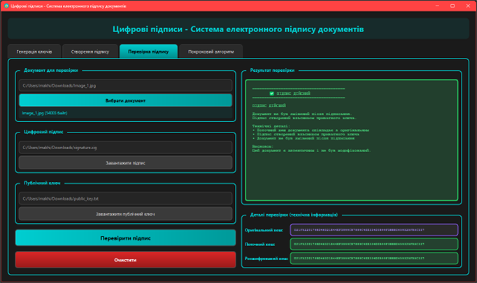
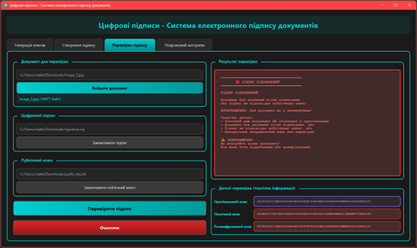
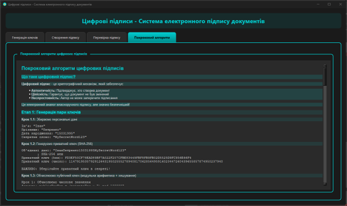

# Лабораторна робота №4: Цифрові підписи

Десктопна програма на Qt для генерації ключів, створення та перевірки електронних цифрових підписів документів з підтримкою різних алгоритмів хешування.

## Зміст

- [Опис програми](#опис-програми)
- [Функціональні можливості](#функціональні-можливості)
- [Вимоги до системи](#вимоги-до-системи)
- [Встановлення](#встановлення)
- [Інструкція користувача](#інструкція-користувача)
- [Архітектура програми](#архітектура-програми)
- [Скріншоти](#скріншоти)

## Опис програми

**Цифрові підписи** — це настільний застосунок, розроблений на C++ з використанням фреймворку Qt, який демонструє принципи роботи електронних цифрових підписів та криптографії з відкритим ключем.

### Основні можливості:

- Генерація пари ключів (приватний + публічний) з персональних даних.
- Створення цифрового підпису документа.
- Перевірка автентичності та цілісності документа.
- Виявлення підробок та модифікацій документів.
- Підтримка алгоритмів хешування: SHA-256, SHA-512, MD5.
- Збереження та завантаження ключів і підписів з файлів.
- Покрокове пояснення алгоритму.
- Сучасний темний інтерфейс.

## Функціональні можливості

### 1. Генерація ключів

- Створення приватного ключа з персональних даних через SHA-256.
- Генерація публічного ключа за формулою: `publicKey = (privateKey × 7) mod 1000007`.
- Вибір алгоритму хешування (SHA-256, SHA-512, MD5).
- Збереження ключів у окремі файли (.key).
- Автоматичне заповнення форми прикладом.

### 2. Створення підпису

- Завантаження будь-якого файлу для підписання.
- Обчислення хешу документа.
- Створення цифрового підпису за допомогою приватного ключа.
- Збереження підпису у файл (.sig).
- Відображення інформації про документ (назва, розмір, хеш).

### 3. Перевірка підпису

- Завантаження документа, підпису та публічного ключа.
- Автоматична перевірка автентичності та цілісності.
- Виявлення модифікацій документа.
- Детальне відображення результатів перевірки:
  - Оригінальний хеш (з підпису).
  - Поточний хеш (фактичний документ).
  - Розшифрований хеш (з публічного ключа).
  - Висновок про дійсність підпису.

### 4. Покроковий алгоритм

- Пояснення концепції асимметричного шифрування.
- Демонстрація генерації ключів з прикладами.
- Візуалізація процесу створення підпису.
- Опис процесу перевірки підпису.
- Приклади виявлення підробок.

## Вимоги до системи

### Мінімальні вимоги:

- **Операційна система:**
  - Windows 10/11.
  - Linux (Ubuntu 20.04+, Fedora 35+).
  - macOS 11+.

- **Програмне забезпечення:**
  - Qt 6.x або Qt 5.15+ (з модулями Core, GUI, Widgets).
  - Компілятор C++17 (GCC 8+, Clang 7+, MSVC 2019+).
  - CMake 3.16+ або qmake.

- **Апаратні вимоги:**
  - Процесор: 1 GHz.
  - ОЗП: 512 MB.
  - Вільне місце на диску: 100 MB.

## Встановлення

### Крок 1: Встановлення Qt.

#### Linux (Ubuntu/Debian):
```bash
sudo apt update
sudo apt install qt6-base-dev qt6-tools-dev build-essential
```

#### Linux (Fedora):
```bash
sudo dnf install qt6-qtbase-devel qt6-qttools-devel gcc-c++
```

#### Windows:
1. Завантажте Qt Online Installer з [qt.io/download](https://www.qt.io/download).
2. Встановіть Qt 6.x з компонентом "Desktop gcc" або "MSVC".
3. Додайте шлях до `bin` директорії Qt у змінну PATH.

#### macOS:
```bash
brew install qt@6
```

### Крок 2: Завантаження проєкту.

```bash
unzip lab04.zip
cd lab04
```

### Крок 3: Збірка та запуск проєкту.

1. Запустіть Qt Creator.
2. Відкрийте файл `lab04.pro` (File → Open File or Project).
3. Виберіть комплект (kit) для збірки.
4. Натисніть кнопку "Configure Project".
5. Натисніть ▶️ (Run) або Ctrl+R.

## Інструкція користувача

Програма має 4 основні вкладки для роботи з цифровими підписами.

### Вкладка 1: Генерація ключів

#### Крок 1: Заповнення персональних даних

1. **Ім'я**: введіть ім'я.
2. **Прізвище**: введіть прізвище.
3. **Дата народження**: виберіть дату у календарі.
4. **Секретне слово**: введіть секретне слово (додатковий фактор безпеки).

**Підказка:** Натисніть кнопку "Приклад" для автозаповнення тестовими даними.

#### Крок 2: Вибір алгоритму хешування

Виберіть один з алгоритмів:
- **SHA-256** (рекомендовано) - надійний, швидкий.
- **SHA-512** - більш безпечний, повільніший.
- **MD5** - застарілий, тільки для демонстрації.

**Важливо:** MD5 є криптографічно ненадійним і не рекомендується для реального використання!

#### Крок 3: Генерація ключів

1. Натисніть кнопку **"Згенерувати ключі"**.
2. Програма створить пару ключів:
   - **Приватний ключ** (зберігайте в секреті!).
   - **Публічний ключ** (можна передавати іншим).

#### Крок 4: Збереження ключів

1. Натисніть **"Зберегти приватний ключ"** → виберіть місце → збережіть як `private.key`.
2. Натисніть **"Зберегти публічний ключ"** → збережіть як `public.key`.

**Безпека:** Ніколи не передавайте приватний ключ іншим особам!

---

### Вкладка 2: Створення підпису

#### Крок 1: Вибір документа

1. Натисніть кнопку **"Вибрати документ"**.
2. Виберіть будь-який файл для підписання (TXT, PDF, DOCX, тощо).
3. Програма автоматично обчислить і відобразить:
   - Назву файлу.
   - Розмір файлу.
   - Хеш документа.

#### Крок 2: Завантаження приватного ключа

1. Натисніть кнопку **"Завантажити приватний ключ"**.
2. Виберіть файл з приватним ключем (наприклад, `private.key`).

#### Крок 3: Створення підпису

1. Натисніть кнопку **"Створити підпис"**.
2. Програма:
   - Обчислить хеш документа.
   - "Зашифрує" хеш приватним ключем (XOR операція).
   - Відобразить цифровий підпис.

#### Крок 4: Збереження підпису

1. Натисніть кнопку **"Зберегти підпис"**.
2. Збережіть підпис у файл (наприклад, `document.sig`).

**Рекомендація:** Зберігайте підпис з ім'ям документа, наприклад: `contract.pdf.sig`.

---

### Вкладка 3: Перевірка підпису

#### Крок 1: Завантаження документа

1. Натисніть кнопку **"Вибрати документ"**.
2. Виберіть файл для перевірки.

#### Крок 2: Завантаження підпису

1. Натисніть кнопку **"Завантажити підпис"**.
2. Виберіть відповідний файл підпису (`.sig`).

#### Крок 3: Завантаження публічного ключа

1. Натисніть кнопку **"Завантажити публічний ключ"**.
2. Виберіть файл з публічним ключем (`.key`).

#### Крок 4: Перевірка

1. Натисніть кнопку **"Перевірити підпис"**.
2. Програма виконає перевірку та відобразить результат:

**✅ Підпис дійсний:**
```
Оригінальний хеш:   A7F3C9E1...
Поточний хеш:       A7F3C9E1...
Розшифрований хеш:  A7F3C9E1...

Висновок: Документ автентичний і не був змінений.
```

**❌ Підпис недійсний:**
```
Оригінальний хеш:   A7F3C9E1...
Поточний хеш:       B8E4D0F2... (ВІДРІЗНЯЄТЬСЯ!)
Розшифрований хеш:  A7F3C9E1...

Висновок: УВАГА! Документ був модифікований після підписання!
```

#### Можливі результати:

| Результат               | Пояснення                                |
|-------------------------|------------------------------------------|
| ✅ Підпис дійсний      | Документ автентичний, не змінений        |
| ❌ Документ змінено    | Хеші не співпадають - файл модифіковано  |
| ❌ Невірний ключ       | Публічний ключ не відповідає приватному  |
| ❌ Пошкоджений підпис  | Файл підпису пошкоджено або неправильний |

---

### Вкладка 4: Покроковий алгоритм

Навчальна секція з детальним поясненням принципів цифрових підписів.

**Що включає:**

1. **Концепція асимметричного шифрування:**
   - Чому потрібні два ключі?
   - Як вони пов'язані між собою?
   - Математична основа (модульна арифметика).

2. **Генерація ключів:**
   ```
   Персональні дані: Яна + Махиня + 31102005 + SecretWord
   ↓ SHA-256
   Приватний ключ: A7F3C9E1B5D2468F... (hex)
   ↓ Модульна арифметика
   Публічний ключ = (PrivateKey × 7) mod 1000007
   Публічний ключ: 456789 (число)
   ```

3. **Створення підпису:**
   ```
   Документ → SHA-256 → Хеш
   Хеш + Приватний ключ → XOR шифрування → Підпис
   ```

4. **Перевірка підпису:**
   ```
   Підпис + Публічний ключ → XOR дешифрування → Хеш₁
   Документ → SHA-256 → Хеш₂
   Якщо Хеш₁ == Хеш₂ → Підпис дійсний ✅
   ```

5. **Виявлення підробок:**
   - Приклади модифікації документа.
   - Як підпис виявляє навіть мінімальні зміни.
   - Чому неможливо підробити підпис без приватного ключа.

---

---

### Поради та рекомендації

**Безпека ключів:**
- Зберігайте приватний ключ у безпечному місці.
- Ніколи не передавайте приватний ключ електронною поштою.
- Використовуйте різні ключі для різних цілей.
- Регулярно оновлюйте ключі (раз на рік).

**Вибір алгоритму:**
- **SHA-256**: оптимальний баланс безпеки та швидкості.
- **SHA-512**: для максимальної безпеки (важливі документи).
- **MD5**: тільки для навчальних цілей, не використовуйте в продакшн.

**Робота з файлами:**
- Завжди перевіряйте підписи отриманих файлів.
- Зберігайте підписи разом з документами.
- Використовуйте зрозумілі назви файлів (document.pdf → document.pdf.sig).

## Архітектура програми

### Структура проєкту:

```
lab04/Digital Signature/
|    ├── Main.cpp                              # Точка входу в програму.
|    ├── DigitalSignatureEngine.h              # Заголовок движка цифрових підписів.
|    ├── DigitalSignatureEngine.cpp            # Реалізація алгоритмів підписів.
│    ├── DigitalSignatureWindow.h              # Заголовок головного вікна.
│    ├── DigitalSignatureWindow.cpp            # Конструктор та базова ініціалізація.
│    ├── DigitalSignatureWindow_UI.cpp         # Створення інтерфейсу (4 вкладки).
│    ├── DigitalSignatureWindow_Slots.cpp      # Обробники подій (слоти).
│    ├── DigitalSignatureWindow_Helpers.cpp    # Допоміжні методи та стилі.
│    └── lab04.pro                             # Файл проєкту Qt (qmake).
└── README.md                             # Цей файл.
```

### Модулі програми:

1. **Main.cpp**
   - Точка входу в програму.
   - Створення QApplication.
   - Запуск головного вікна.

2. **DigitalSignatureEngine (DigitalSignatureEngine.h/cpp)**
   - Ядро логіки цифрових підписів.
   - Генерація пари ключів (приватний + публічний).
   - Створення цифрового підпису.
   - Перевірка підпису.
   - Підтримка різних алгоритмів хешування (SHA-256, SHA-512, MD5).
   - XOR-шифрування/дешифрування.

3. **DigitalSignatureWindow (DigitalSignatureWindow.h/cpp + 3 допоміжні файли)**
   - Головне вікно програми.
   - Управління UI елементами.
   - Обробка подій користувача (слоти).
   - Відображення результатів перевірки.
   - Застосування темної теми.

### Принципи проєктування:

- **Розділення відповідальностей (SRP)**: кожен клас відповідає за одну область.
- **Модульність**: UI розділений на окремі файли за функціоналом.
- **Інкапсуляція**: деталі алгоритму приховані в Engine.
- **Чистий код**: детальні коментарі, зрозумілі назви змінних.

## Скріншоти

### Вкладка "Генерація ключів".



### Вкладка "Створення підпису".



### Вкладка "Перевірка підпису (Підпис дійсний)".



### Вкладка "Перевірка підпису (Підпис підроблений)".



### Вкладка "Покроковий алгоритм".



---

## Технічні деталі

### Використані технології:

- **Мова програмування**: C++17.
- **GUI фреймворк**: Qt 6.x (Core, GUI, Widgets).
- **Система збірки**: qmake / CMake.
- **Криптографія**: QCryptographicHash (SHA-256, SHA-512, MD5).

### Особливості реалізації:

1. **Генерація ключів:**
   - Приватний ключ: SHA-256 хеш персональних даних.
   - Публічний ключ: `(privateKey × 7) mod 1000007`.
   - Множник 7 та модуль 1000007 (просте число).

2. **Створення підпису:**
   - Обчислення хешу документа (SHA-256/SHA-512/MD5).
   - XOR-"шифрування" хешу приватним ключем.
   - Підпис у hex-форматі.

3. **Перевірка підпису:**
   - Обчислення хешу поточного документа.
   - XOR-"дешифрування" підпису публічним ключем.
   - Порівняння хешів.

4. **Алгоритми хешування:**
   - SHA-256: 64 символи hex (256 біт).
   - SHA-512: 128 символів hex (512 біт).
   - MD5: 32 символи hex (128 біт).

5. **Формати файлів:**
   - Ключі: `.key` (текстовий файл з hex-рядком).
   - Підписи: `.sig` (текстовий файл з hex-рядком).

## Відомі обмеження

- Спрощена реалізація для демонстраційних цілей (не RSA/DSA).
- XOR-шифрування не є криптографічно стійким.
- MD5 застарілий і вразливий до колізій.
- Не рекомендується для використання в критичних системах.
