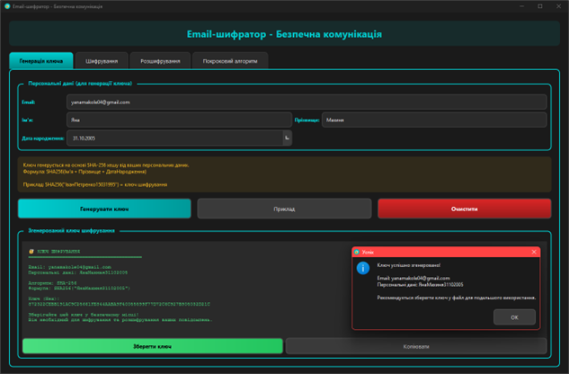
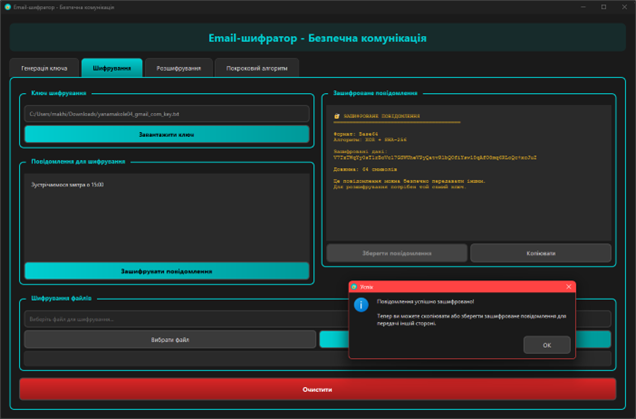
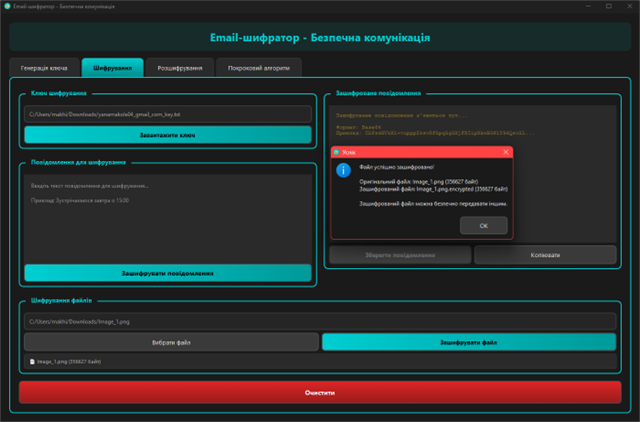
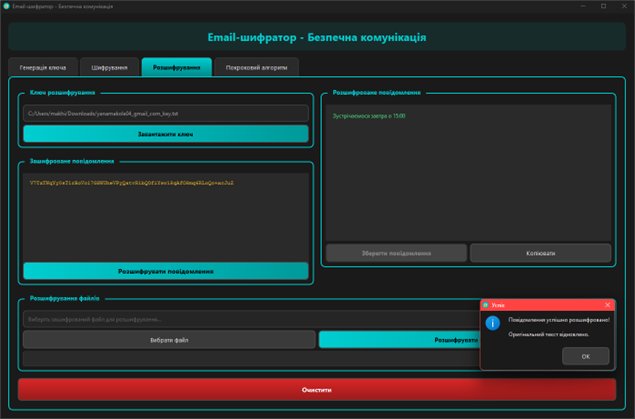
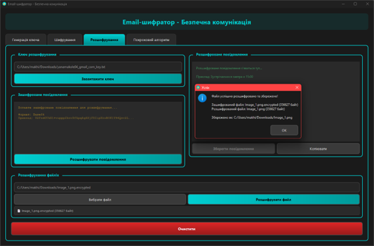
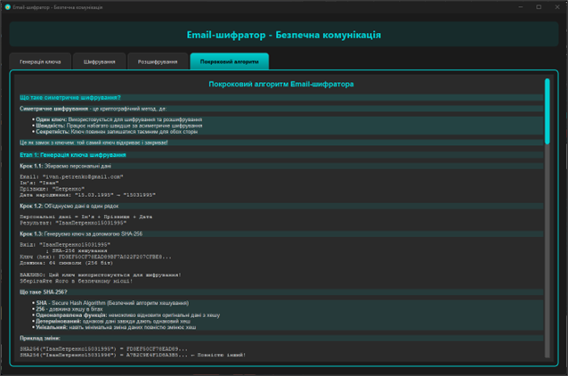

# Лабораторна робота №5: Email-шифратор

Десктопна програма на Qt для шифрування та розшифрування електронних повідомлень і файлів з використанням симетричного шифрування на основі XOR та SHA-256.

## Зміст

- [Опис програми](#опис-програми)
- [Функціональні можливості](#функціональні-можливості)
- [Вимоги до системи](#вимоги-до-системи)
- [Встановлення](#встановлення)
- [Інструкція користувача](#інструкція-користувача)
- [Архітектура програми](#архітектура-програми)
- [Скріншоти](#скріншоти)

## Опис програми

**Email-шифратор** — це настільний застосунок, розроблений на C++ з використанням фреймворку Qt, який забезпечує безпечне шифрування електронних повідомлень та файлів для конфіденційної комунікації.

### Основні можливості:

- Генерація ключів шифрування з персональних даних через SHA-256.
- Шифрування текстових повідомлень (Base64 кодування).
- Розшифрування текстових повідомлень.
- Шифрування файлів будь-якого типу.
- Розшифрування зашифрованих файлів.
- Збереження та завантаження ключів з файлів (.key).
- Покрокове пояснення алгоритму симетричного шифрування.
- Сучасний темний інтерфейс.

## Функціональні можливості

### 1. Генерація ключа

- Створення ключа шифрування з персональних даних.
- Використання SHA-256 для генерації 256-бітного ключа.
- Вхідні дані: email, ім'я, прізвище, рік народження.
- Відображення ключа у hex-форматі (64 символи).
- Збереження ключа у файл (.key) для подальшого використання.
- Автоматичне заповнення форми прикладом.

### 2. Шифрування

**Шифрування повідомлень:**
- Введення текстового повідомлення будь-якої довжини.
- Шифрування за допомогою XOR-алгоритму.
- Кодування результату в Base64 для зручного передавання.
- Збереження зашифрованого повідомлення у файл.
- Копіювання зашифрованого тексту в буфер обміну.

**Шифрування файлів:**
- Підтримка файлів будь-якого типу (документи, зображення, архіви).
- Збереження оригінального розширення файлу.
- Автоматичне додавання суфікса `.encrypted` до назви файлу.
- Відображення інформації про файл (назва, розмір).

### 3. Розшифрування

**Розшифрування повідомлень:**
- Введення або вставка зашифрованого тексту (Base64).
- Автоматичне декодування та розшифрування.
- Відображення оригінального повідомлення.
- Збереження розшифрованого тексту.

**Розшифрування файлів:**
- Завантаження зашифрованих файлів (.encrypted).
- Розшифрування з відновленням оригінального формату.
- Збереження розшифрованого файлу з вихідною назвою.
- Перевірка правильності ключа.

### 4. Покроковий алгоритм

- Пояснення концепції симетричного шифрування.
- Демонстрація генерації ключа з прикладами.
- Візуалізація процесу XOR-шифрування.
- Опис Base64 кодування.
- Приклади з конкретними даними.

## Вимоги до системи

### Мінімальні вимоги:

- **Операційна система:**
  - Windows 10/11.
  - Linux (Ubuntu 20.04+, Fedora 35+).
  - macOS 11+.

- **Програмне забезпечення:**
  - Qt 6.x або Qt 5.15+ (з модулями Core, GUI, Widgets).
  - Компілятор C++17 (GCC 8+, Clang 7+, MSVC 2019+).
  - CMake 3.16+ або qmake.

- **Апаратні вимоги:**
  - Процесор: 1 GHz.
  - ОЗП: 512 MB.
  - Вільне місце на диску: 100 MB.

## Встановлення

### Крок 1: Встановлення Qt.

#### Linux (Ubuntu/Debian):
```bash
sudo apt update
sudo apt install qt6-base-dev qt6-tools-dev build-essential
```

#### Linux (Fedora):
```bash
sudo dnf install qt6-qtbase-devel qt6-qttools-devel gcc-c++
```

#### Windows:
1. Завантажте Qt Online Installer з [qt.io/download](https://www.qt.io/download).
2. Встановіть Qt 6.x з компонентом "Desktop gcc" або "MSVC".
3. Додайте шлях до `bin` директорії Qt у змінну PATH.

#### macOS:
```bash
brew install qt@6
```

### Крок 2: Завантаження проєкту.

```bash
unzip lab05.zip
cd lab05
```

### Крок 3: Збірка та запуск проєкту.

1. Запустіть Qt Creator.
2. Відкрийте файл `lab05.pro` (File → Open File or Project).
3. Виберіть комплект (kit) для збірки.
4. Натисніть кнопку "Configure Project".
5. Натисніть ▶️ (Run) або Ctrl+R.

## Інструкція користувача

Програма має 4 основні вкладки для роботи з шифруванням.

### Вкладка 1: Генерація ключа

#### Крок 1: Заповнення персональних даних

1. **Email**: введіть email адресу.
2. **Ім'я**: введіть ім'я.
3. **Прізвище**: введіть прізвище.
4. **Дата народження**: виберіть рік народження.

**Підказка:** Натисніть кнопку "Приклад" для автозаповнення тестовими даними.

#### Крок 2: Генерація ключа

1. Натисніть кнопку **"Згенерувати ключ"**.
2. Програма створить 256-бітний ключ шифрування:
   ```
   Персональні дані: ЯнаМахиня31102005
   ↓ SHA-256
   Ключ: A7F3C9E1B5D2468F1234567890ABCDEF...
   ```
3. Ключ відобразиться у нижньому полі (64 hex-символи).

#### Крок 3: Збереження ключа

1. Натисніть кнопку **"Зберегти ключ"**.
2. Виберіть місце для збереження → введіть назву, наприклад `my_encryption_key.key`.
3. Файл буде збережено у текстовому форматі.

**Важливо:** 
- Зберігайте ключ у безпечному місці!
- Без ключа розшифрувати дані неможливо!
- Не передавайте ключ небезпечними каналами!

---

### Вкладка 2: Шифрування

#### Шифрування повідомлення

**Крок 1: Завантаження ключа**

1. Натисніть кнопку **"Завантажити ключ"**.
2. Виберіть файл ключа (наприклад, `my_encryption_key.key`).
3. Програма підтвердить завантаження ключа.

**Крок 2: Введення повідомлення**

1. У верхнє текстове поле введіть ваше повідомлення:
   ```
   Приклад: "Конфіденційна інформація про зустріч о 15:00"
   ```
2. Повідомлення може містити:
   - Українські та англійські літери.
   - Цифри та спеціальні символи.
   - Багаторядковий текст.

**Крок 3: Шифрування**

1. Натисніть кнопку **"Зашифрувати повідомлення"**.
2. Програма виконає:
   - XOR-шифрування з ключем.
   - Base64 кодування результату.
3. Зашифроване повідомлення з'явиться в нижньому полі:
   ```
   Результат: SGVsbG8gV29ybGQh... (Base64)
   ```

**Крок 4: Збереження або відправка**

1. Натисніть **"Зберегти зашифроване повідомлення"** → збережіть у файл.
2. Або скопіюйте текст (Ctrl+A, Ctrl+C) для відправки email.

#### Шифрування файлу

**Крок 1: Завантаження ключа**

1. Завантажте ключ шифрування (як у повідомленнях).

**Крок 2: Вибір файлу**

1. Натисніть кнопку **"Вибрати файл"**.
2. Виберіть будь-який файл:
   - Документи (PDF, DOCX, TXT).
   - Зображення (JPG, PNG).
   - Архіви (ZIP, RAR).
   - Інші типи файлів.
3. Програма відобразить інформацію про файл.

**Крок 3: Шифрування файлу**

1. Натисніть кнопку **"Зашифрувати файл"**.
2. Виберіть місце для збереження зашифрованого файлу.
3. Файл буде збережено з суфіксом `.encrypted`:
   ```
   Оригінал:    document.pdf
   Зашифрований: document.pdf.encrypted
   ```

**Рекомендація:** Зберігайте оригінали в безпечному місці або видаляйте після шифрування.

---

### Вкладка 3: Розшифрування

#### Розшифрування повідомлення

**Крок 1: Завантаження ключа**

1. Натисніть кнопку **"Завантажити ключ"**.
2. Виберіть той самий ключ, що використовувався для шифрування.

**Крок 2: Введення зашифрованого тексту**

1. У верхнє поле вставте зашифроване повідомлення (Base64):
   ```
   SGVsbG8gV29ybGQh...
   ```
2. Або завантажте з файлу (якщо зберігали).

**Крок 3: Розшифрування**

1. Натисніть кнопку **"Розшифрувати повідомлення"**.
2. Оригінальне повідомлення з'явиться в нижньому полі.

✅ **Успішне розшифрування:** З'явиться оригінальний текст.
❌ **Помилка:** Перевірте правильність ключа або формат даних.

#### Розшифрування файлу

**Крок 1: Завантаження ключа**

1. Завантажте ключ розшифрування.

**Крок 2: Вибір зашифрованого файлу**

1. Натисніть кнопку **"Вибрати файл"**.
2. Виберіть файл з розширенням `.encrypted`.

**Крок 3: Розшифрування**

1. Натисніть кнопку **"Розшифрувати файл"**.
2. Програма автоматично визначить оригінальне розширення.

**Крок 4: Збереження**

1. Натисніть кнопку **"Зберегти розшифрований файл"**.
2. Виберіть місце та назву для збереження.
3. Файл буде відновлено у оригінальному форматі.

#### Можливі помилки:

| Помилка                  | Причина           | Рішення                      |
|--------------------------|-------------------|------------------------------|
| "Неможливо розшифрувати" | Неправильний ключ | Використайте правильний ключ |
| "Невірний формат"        | Пошкоджені дані   | Перевірте файл або текст     |
| "Файл не знайдено"       | Відсутній файл    | Перевірте шлях до файлу      |

---

### Вкладка 4: Покроковий алгоритм

Навчальна секція з детальним поясненням алгоритму шифрування.

**Що включає:**

1. **Концепція симетричного шифрування:**
   - Що таке симетричне шифрування?
   - Чому використовується один ключ?
   - Переваги та недоліки.

2. **Генерація ключа (SHA-256):**
   ```
   Персональні дані: Яна + Махиня + 31102005
   ↓ Об'єднання
   "ЯнаМахиня31102005"
   ↓ SHA-256 хешування
   Ключ (256 біт): A7F3C9E1B5D2468F1234567890ABCDEF...
   ```

3. **XOR-шифрування:**
   ```
   Оригінальний текст:  "Hello"
   У байтах:             [72, 101, 108, 108, 111]
   
   Ключ (перші 5 байт): [167, 243, 201, 225, 181]
   
   XOR операція:
   72  XOR 167 = 239
   101 XOR 243 = 142
   108 XOR 201 = 169
   108 XOR 225 = 133
   111 XOR 181 = 218
   
   Зашифровано:         [239, 142, 169, 133, 218]
   ↓ Base64
   Результат:           "746iaYXa"
   ```

4. **Base64 кодування:**
   - Чому потрібне Base64?
   - Як працює перетворення байтів у текст.
   - Приклади кодування.

5. **Розшифрування:**
   - Зворотний процес XOR.
   - Декодування Base64.
   - Відновлення оригінальних даних.

---

### Поради та рекомендації

**Безпека ключів:**
- Ніколи не передавайте ключ тим самим каналом, що й зашифровані дані.
- Використовуйте різні ключі для різних отримувачів.
- Періодично змінюйте ключі (раз на місяць).
- Зберігайте ключі на USB-флешці або в менеджері паролів.

**Шифрування повідомлень:**
- Перевіряйте правильність ключа перед відправкою.
- Копіюйте зашифрований текст цілком (включаючи всі символи).
- Використовуйте текстовий формат (TXT) для збереження.

**Шифрування файлів:**
- Великі файли (>100 MB) можуть шифруватися довше.
- Завжди перевіряйте цілісність після розшифрування.
- Зберігайте резервні копії зашифрованих файлів.

**Обмеження:**
- Це навчальна реалізація, для продакшн використовуйте AES-256.
- XOR-шифрування менш безпечне, ніж сучасні алгоритми.
- Для критичних даних використовуйте професійні рішення (GPG, VeraCrypt).

## Архітектура програми

### Структура проєкту:

```
lab05/Email Encryptor/
|    ├── Main.cpp                              # Точка входу в програму.
|    ├── EncryptionEngine.h                    # Заголовок движка шифрування.
|    ├── EncryptionEngine.cpp                  # Реалізація алгоритмів шифрування.
|    ├── EmailEncryptorWindow.h                # Заголовок головного вікна.
|    ├── EmailEncryptorWindow.cpp              # Конструктор та базова ініціалізація.
|    ├── EmailEncryptorWindow_UI.cpp           # Створення інтерфейсу (4 вкладки).
|    ├── EmailEncryptorWindow_Slots.cpp        # Обробники подій (слоти).
|    ├── EmailEncryptorWindow_Helpers.cpp      # Допоміжні методи та стилі.
|    ├── EmailEncryptorWindow_StepByStep.cpp   # Генерація пояснення алгоритму.
|    └── lab05.pro                             # Файл проєкту Qt (qmake).
└── README.md                             # Цей файл.
```

### Модулі програми:

1. **Main.cpp**
   - Точка входу в програму.
   - Створення QApplication.
   - Запуск головного вікна.

2. **EncryptionEngine (EncryptionEngine.h/cpp)**
   - Ядро логіки шифрування.
   - Генерація ключа з персональних даних (SHA-256).
   - XOR-шифрування/розшифрування повідомлень.
   - XOR-шифрування/розшифрування файлів.
   - Base64 кодування/декодування.
   - Підготовка ключа до потрібної довжини.

3. **EmailEncryptorWindow (EmailEncryptorWindow.h/cpp + 4 допоміжні файли)**
   - Головне вікно програми.
   - Управління UI елементами.
   - Обробка подій користувача (слоти).
   - Генерація HTML-пояснення алгоритму.
   - Застосування темної теми.

### Принципи проєктування:

- **Розділення відповідальностей (SRP)**: кожен клас відповідає за одну область.
- **Модульність**: UI розділений на окремі файли за функціоналом.
- **Інкапсуляція**: деталі алгоритму приховані в Engine.
- **Чистий код**: детальні коментарі, зрозумілі назви змінних.

## Скріншоти

### Вкладка "Генерація ключа".



### Вкладка "Шифрування текстового повідомлення/файлу".





### Вкладка "Розшифрування текстового повідомлення/файлу".





### Вкладка "Покроковий алгоритм".



---

## Технічні деталі

### Використані технології:

- **Мова програмування**: C++17.
- **GUI фреймворк**: Qt 6.x (Core, GUI, Widgets).
- **Система збірки**: qmake / CMake.
- **Криптографія**: QCryptographicHash (SHA-256).

### Особливості реалізації:

1. **Генерація ключа:**
   - SHA-256 хешування персональних даних.
   - Ключ довжиною 256 біт (64 hex-символи).
   - Формат: `Email + FirstName + LastName + BirthYear`.

2. **XOR-шифрування:**
   - Симетричний алгоритм (той самий ключ для шифрування/розшифрування).
   - Циклічне повторення ключа для великих даних.
   - Швидкість: O(n) де n - розмір даних.

3. **Base64 кодування:**
   - Перетворення двійкових даних у текст.
   - Збільшення розміру на ~33%.
   - Використання стандартної реалізації Qt.

4. **Формати файлів:**
   - Ключі: `.key` (текстовий файл, 64 hex-символи).
   - Зашифровані файли: оригінальна назва + `.encrypted`.
   - Повідомлення: Base64 текст.

## Відомі обмеження

- XOR-шифрування є базовим і не рекомендується для критичних даних.
- SHA-256 використовується для генерації ключа.
- Відсутня аутентифікація повідомлень (MAC/HMAC).
- Немає захисту від атак типу known-plaintext.
- Для продакшн використовуйте AES-256-GCM або ChaCha20-Poly1305.
