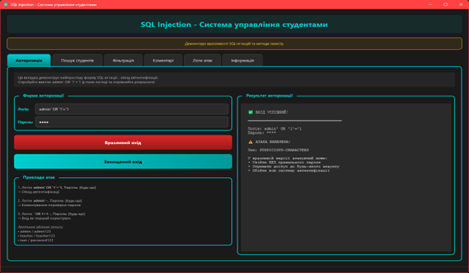
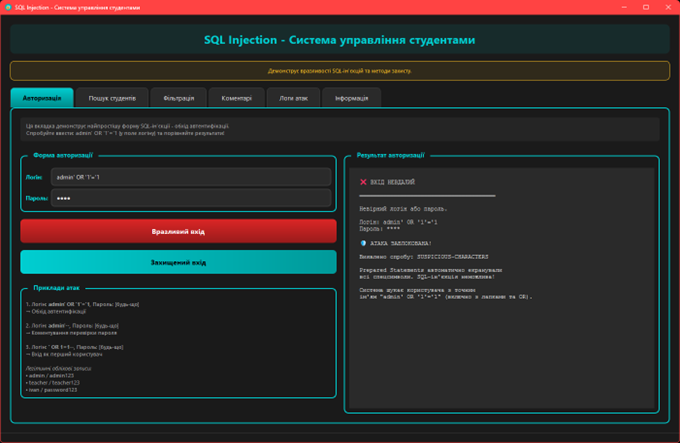
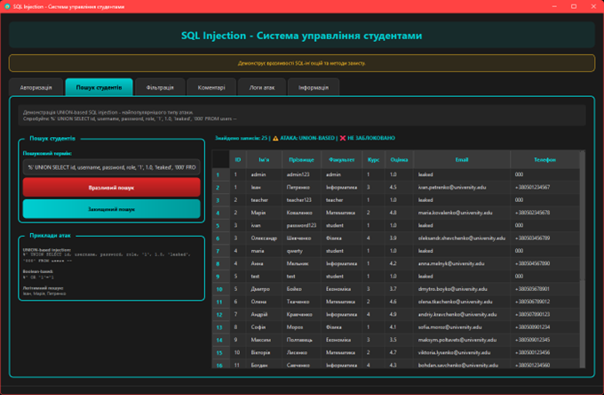
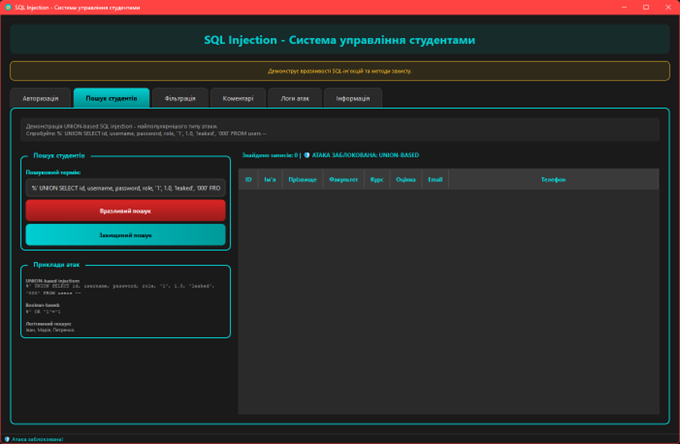
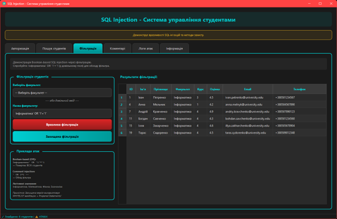
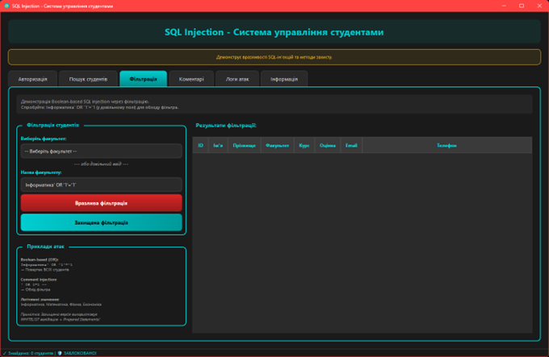
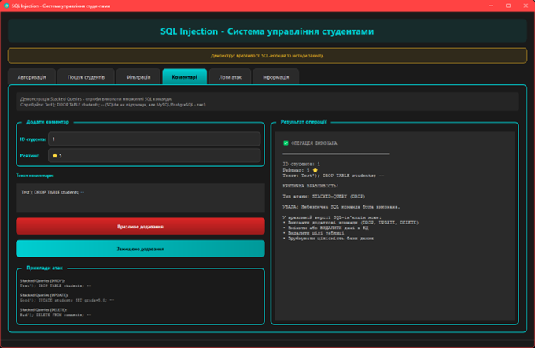
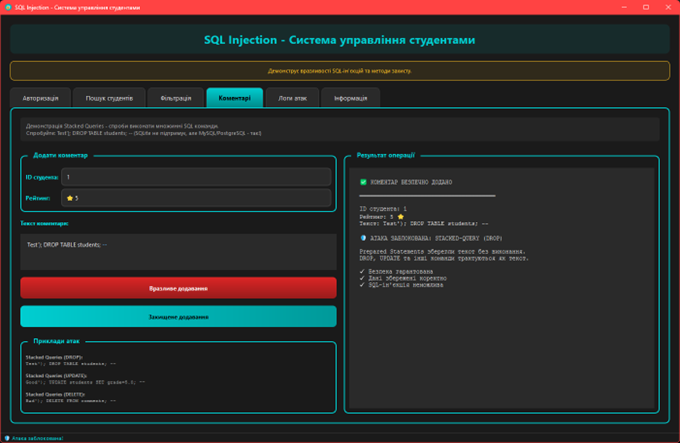
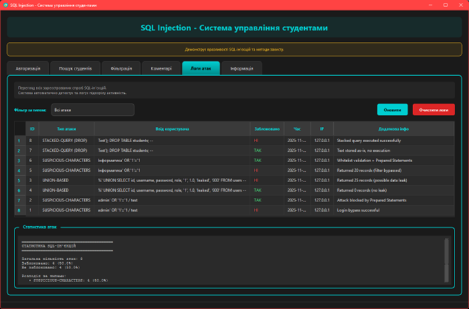
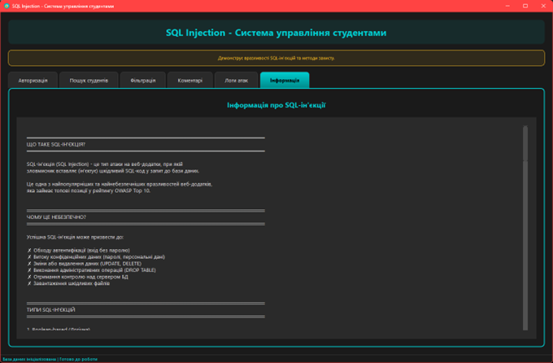

# Лабораторна робота №6: SQL Injection - Демонстрація вразливостей

Десктопна програма на Qt для демонстрації SQL-ін'єкцій, їх виявлення та методів захисту з використанням Prepared Statements та системи логування атак.

## Зміст

- [Опис програми](#опис-програми)
- [Функціональні можливості](#функціональні-можливості)
- [Вимоги до системи](#вимоги-до-системи)
- [Встановлення](#встановлення)
- [Інструкція користувача](#інструкція-користувача)
- [Архітектура програми](#архітектура-програми)
- [Скріншоти](#скріншоти)

## Опис програми

**SQL Injection** — це навчальний застосунок, розроблений на C++ з використанням фреймворку Qt, який демонструє типові вразливості веб-додатків до SQL-ін'єкцій та правильні методи захисту.

### Основні можливості:

- Демонстрація вразливих SQL-запитів (без захисту).
- Демонстрація захищених SQL-запитів (Prepared Statements).
- 4 типи SQL-ін'єкцій: авторизація, пошук, фільтрація, коментарі.
- Автоматичне логування спроб атак з детальною інформацією.
- Статистика та аналіз виявлених атак.
- Покрокове пояснення принципів SQL-ін'єкцій та захисту.
- Тестова база даних з 20 студентами та 5 користувачами.
- Сучасний темний інтерфейс.

## Функціональні можливості

### 1. Авторизація (Login)

**Вразливий варіант:**
- Пряма конкатенація username і password у SQL.
- Можливі атаки: `' OR '1'='1`, `admin'--`, `' OR 1=1--`.
- Обхід автентифікації без знання пароля.

**Захищений варіант:**
- Використання Prepared Statements з плейсхолдерами.
- Автоматичне екранування спецсимволів.
- Неможливість модифікації структури SQL-запиту.

### 2. Пошук студентів (Search)

**Вразливий варіант:**
- Підставлення пошукового терміну в LIKE без валідації.
- UNION-based атаки для витоку даних з інших таблиць.
- Приклад: `%' UNION SELECT * FROM users--`.

**Захищений варіант:**
- Prepared Statements з параметризацією LIKE.
- Валідація довжини пошукового запиту (max 100 символів).
- Whitelist дозволених символів.

### 3. Фільтрація за факультетом (Filter)

**Вразливий варіант:**
- Пряме підставлення назви факультету у WHERE.
- Можливість виконання додаткових умов: `Інформатика' OR '1'='1`.
- Витік всіх записів з таблиці.

**Захищений варіант:**
- Whitelist валідація (дозволені тільки існуючі факультети).
- Prepared Statements для додаткового захисту.
- Подвійний рівень безпеки.

### 4. Додавання коментарів (Comments)

**Вразливий варіант:**
- Підставлення тексту коментаря в INSERT без екранування.
- Можливість виконання множинних запитів: `'; DROP TABLE students--`.
- Модифікація даних через коментарі.

**Захищений варіант:**
- Prepared Statements для INSERT.
- Валідація student ID (> 0).
- Валідація рейтингу (1-5).
- Обмеження довжини коментаря (max 1000 символів).

### 5. Логування атак (Attack Logs)

- Автоматичне виявлення підозрілих патернів у введенні.
- Запис типу атаки, SQL-запиту, часу та результату.
- Статистика за типами атак.
- Фільтрація логів за категоріями.
- Очищення старих логів.

### 6. Інформація та довідка

- Детальне пояснення концепції SQL-ін'єкцій.
- Приклади атак з поясненнями.
- Методи захисту (Prepared Statements, Whitelist, валідація).
- Рекомендації OWASP Top 10.

## Вимоги до системи

### Мінімальні вимоги:

- **Операційна система:**
  - Windows 10/11.
  - Linux (Ubuntu 20.04+, Fedora 35+).
  - macOS 11+.

- **Програмне забезпечення:**
  - Qt 6.x або Qt 5.15+ (з модулями Core, GUI, Widgets, SQL).
  - Компілятор C++17 (GCC 8+, Clang 7+, MSVC 2019+).
  - SQLite (вбудовано в Qt).
  - CMake 3.16+ або qmake.

- **Апаратні вимоги:**
  - Процесор: 1 GHz.
  - ОЗП: 512 MB.
  - Вільне місце на диску: 100 MB.

## Встановлення

### Крок 1: Встановлення Qt.

#### Linux (Ubuntu/Debian):
```bash
sudo apt update
sudo apt install qt6-base-dev qt6-tools-dev build-essential libqt6sql6-sqlite
```

#### Linux (Fedora):
```bash
sudo dnf install qt6-qtbase-devel qt6-qttools-devel gcc-c++
```

#### Windows:
1. Завантажте Qt Online Installer з [qt.io/download](https://www.qt.io/download).
2. Встановіть Qt 6.x з компонентом "Desktop gcc" або "MSVC".
3. Переконайтеся, що модуль SQL включено.
4. Додайте шлях до `bin` директорії Qt у змінну PATH.

#### macOS:
```bash
brew install qt@6
```

### Крок 2: Завантаження проєкту.

```bash
unzip lab06.zip
cd lab06
```

### Крок 3: Збірка та запуск проєкту.

1. Запустіть Qt Creator.
2. Відкрийте файл `lab06.pro` (File → Open File or Project).
3. Виберіть комплект (kit) для збірки.
4. Натисніть кнопку "Configure Project".
5. Натисніть ▶️ (Run) або Ctrl+R.

При першому запуску програма автоматично створить базу даних `students.db` у папці з виконуваним файлом.

## Інструкція користувача

Програма має 6 основних вкладок для демонстрації SQL-ін'єкцій.

### Вкладка 1: Авторизація

#### Тестування вразливого варіанту

**Приклад 1: Нормальна авторизація**
```
Username: admin
Password: admin123
Результат: Успішний вхід
```

**Приклад 2: SQL Injection - обхід пароля**
```
Username: admin'--
Password: [будь-що]
Результат: Успішний вхід
```

**Пояснення:**
```sql
-- Оригінальний запит:
SELECT * FROM users WHERE username='admin'--' AND password='...'

-- Після ін'єкції:
-- коментує решту запиту
SELECT * FROM users WHERE username='admin'
```

**Приклад 3: SQL Injection - вхід без логіна**
```
Username: ' OR '1'='1
Password: ' OR '1'='1
Результат: Успішний вхід (обхід усієї автентифікації!)
```

**Пояснення:**
```sql
-- Після ін'єкції:
SELECT * FROM users WHERE username='' OR '1'='1' AND password='' OR '1'='1'
-- '1'='1' завжди TRUE → умова завжди виконується
```

#### Тестування захищеного варіанту

```
Username: admin'--
Password: test
Результат: Невірні дані

Причина: Prepared Statement екранував одинарну лапку:
SELECT * FROM users WHERE username='admin''--' AND password='test'
                                           ^^ екранована лапка
```

---

### Вкладка 2: Пошук студентів

#### Тестування вразливого варіанту

**Приклад 1: Нормальний пошук**
```
Пошук: Іван
Результат: Знайдено студентів з іменем "Іван"
```

**Приклад 2: UNION-based SQL Injection**
```
Пошук: %' UNION SELECT id, username, password, role, '1', 1.0, 'hacked', '000' FROM users--
Результат: Витік логінів та паролів з таблиці users.
```

**Пояснення:**
```sql
-- Оригінальний запит:
SELECT * FROM students WHERE first_name LIKE '%Іван%'

-- Після UNION атаки:
SELECT * FROM students WHERE first_name LIKE '%'
UNION SELECT id, username, password, role, '1', 1.0, 'hacked', '000' FROM users--'
-- UNION об'єднує результати з двох таблиць
```

**Приклад 3: Витік всіх записів**
```
Пошук: %' OR '1'='1
Результат: Показано ВСІХ студентів (обхід фільтра)
```

#### Тестування захищеного варіанту

```
Пошук: %' UNION SELECT...
Результат: Знайдено 0 записів

Причина: Prepared Statement трактує весь рядок як текст:
SELECT * FROM students WHERE first_name LIKE '%\%'' UNION SELECT...%'
                                               ^^ екрановано
```

---

### Вкладка 3: Фільтрація за факультетом

#### Тестування вразливого варіанту

**Приклад 1: Нормальна фільтрація**
```
Факультет: Інформатика
Результат: Показано студентів Інформатики
```

**Приклад 2: SQL Injection - витік усіх даних**
```
Факультет: Інформатика' OR '1'='1
Результат: Показано всіх студентів з усіх факультетів
```

**Пояснення:**
```sql
-- Після ін'єкції:
SELECT * FROM students WHERE faculty='Інформатика' OR '1'='1'
                                                    ^^^^^^^^^^^^
                                                    завжди TRUE
```

**Приклад 3: Використання нестандартного поля**
```
Введення власне: Математика' AND grade > 4.5--
Результат: Показано тільки студентів Математики з оцінкою > 4.5
```

#### Тестування захищеного варіанту

```
Факультет: Інформатика' OR '1'='1
Результат: Помилка "Невірний факультет"

Причина: Whitelist валідація! 
Дозволені тільки:
- Інформатика
- Математика
- Фізика
- Економіка
- Хімія
- Біологія

"Інформатика' OR '1'='1" НЕ в списку → блокується!
```

---

### Вкладка 4: Додавання коментарів

#### Тестування вразливого варіанту

**Приклад 1: Нормальний коментар**
```
Student ID: 1
Коментар: Відмінний студент!
Рейтинг: 5
Результат: Коментар додано
```

**Приклад 2: SQL Injection - видалення таблиці**
```
Student ID: 1
Коментар: Nice student'); DROP TABLE students--
Рейтинг: 5
Результат: Таблиця students видалена
```

**Пояснення:**
```sql
-- Оригінальний запит:
INSERT INTO comments (student_id, comment_text, rating) VALUES (1, 'Nice student', 5)

-- Після ін'єкції:
INSERT INTO comments (student_id, comment_text, rating) VALUES (1, 'Nice student');
DROP TABLE students--', 5)
           ^^ закриття INSERT  ^^ видалення таблиці  ^^ коментар
```

**Приклад 3: Модифікація даних**
```
Коментар: test'); UPDATE students SET grade=5.0 WHERE id=1--
Результат: Змінено оцінку студента через коментар
```

#### Тестування захищеного варіанту

```
Коментар: test'); DROP TABLE students--
Результат: Коментар додано зі СПРАВЖНІМ текстом

База даних інтерпретує це як звичайний текст:
"test'); DROP TABLE students--"
Жодних команд не виконується!
```

---

### Вкладка 5: Логи атак

#### Перегляд логів

1. **Автоматичне логування:**
   - Кожна спроба SQL-ін'єкції автоматично записується.
   - Зберігається: тип атаки, SQL-запит, час, статус блокування.

2. **Фільтрація логів:**
   - Всі логи.
   - Тільки заблоковані атаки.
   - Тільки успішні атаки.
   - За типом: OR 1=1, UNION, DROP TABLE, Bypass, Comment Injection.

3. **Статистика:**
   ```
   Загальна кількість атак: 25
   Заблоковано (Secure): 20
   Успішні (Vulnerable): 5
   
   За типами:
   - OR 1=1: 8 атак
   - UNION SELECT: 5 атак
   - Comment Bypass (--): 7 атак
   - DROP TABLE: 3 атаки
   - Quote Escape: 2 атаки
   ```

4. **Очищення логів:**
   - Видалення всіх логів.
   - Видалення старих логів (>30 днів).

#### Детектор атак

Програма автоматично виявляє підозрілі патерни:

| Патерн              | Тип атаки       | Пояснення                     |
|---------------------|-----------------|-------------------------------|
| `' OR '1'='1`       | Boolean-based   | Обхід автентифікації          |
| `' OR 1=1--`        | Boolean-based   | Обхід з коментарем            |
| `admin'--`          | Comment Bypass  | Коментування частини запиту   |
| `UNION SELECT`      | UNION-based     | Об'єднання з іншими таблицями |
| `DROP TABLE`        | Destructive     | Видалення таблиць             |
| `UPDATE` / `DELETE` | Modification    | Модифікація даних             |
| `'; `               | Stacked Queries | Множинні запити               |

---

### Вкладка 6: Інформація

Детальна довідка про SQL-ін'єкції, що включає:

1. **Що таке SQL Injection?**
   - Визначення та принцип роботи.
   - Чому це небезпечно.

2. **Типи SQL-ін'єкцій:**
   - Boolean-based (OR 1=1).
   - UNION-based (витік даних).
   - Time-based (сліпа ін'єкція).
   - Error-based (через помилки).
   - Stacked queries (множинні запити).

3. **Методи захисту:**
   - **Prepared Statements** (найефективніший).
   - Whitelist валідація.
   - Екранування спецсимволів.
   - Обмеження привілеїв БД.
   - WAF (Web Application Firewall).

4. **Приклади коду:**
   - Вразливий код (String Concatenation).
   - Захищений код (Prepared Statements).
   - Порівняння результатів.

5. **Рекомендації:**
   - Ніколи не довіряйте вводу користувача.
   - Завжди використовуйте Prepared Statements.
   - Валідуйте та санітизуйте вхідні дані.
   - Логуйте підозрілу активність.
   - Регулярно оновлюйте ПЗ та бібліотеки.

---

## Архітектура програми

### Структура проєкту:

```
lab06/SQL Injection/
|    ├── Main.cpp                     # Точка входу в програму.
|    ├── MainWindow.h                 # Заголовок головного вікна.
|    ├── MainWindow.cpp               # Реалізація UI та обробників.
|    ├── DatabaseManager.h            # Заголовок менеджера БД.
|    ├── DatabaseManager.cpp          # Створення та наповнення БД.
|    ├── VulnerableQueries.h          # Заголовок вразливих запитів.
|    ├── VulnerableQueries.cpp        # Реалізація вразливих SQL-запитів.
|    ├── SecureQueries.h              # Заголовок захищених запитів.
|    ├── SecureQueries.cpp            # Реалізація Prepared Statements.
|    ├── AttackLogger.h               # Заголовок системи логування.
|    ├── AttackLogger.cpp             # Виявлення та запис атак.
|    ├── lab06.pro                    # Файл проєкту Qt (qmake).
|    └── students.db                  # База даних SQLite (створюється автоматично).
└── README.md                    # Цей файл.
```

### Модулі програми:

1. **Main.cpp**
   - Точка входу в програму.
   - Ініціалізація бази даних.
   - Створення QApplication та головного вікна.

2. **DatabaseManager (DatabaseManager.h/cpp)**
   - Підключення до SQLite бази даних.
   - Створення 4 таблиць: students, users, comments, attack_logs.
   - Наповнення тестовими даними (20 студентів, 5 користувачів).
   - Статичний метод доступу до БД для інших класів.

3. **VulnerableQueries (VulnerableQueries.h/cpp)**
   - Демонстрація вразливих SQL-запитів.
   - Використання String Concatenation (пряме підставлення).
   - 5 типів вразливостей: login, search, filter, comments, grades.
   - Детальні коментарі з поясненням кожної вразливості.

4. **SecureQueries (SecureQueries.h/cpp)**
   - Реалізація захищених SQL-запитів.
   - Використання Prepared Statements (QSqlQuery::prepare, bindValue).
   - Whitelist валідація для критичних полів.
   - Валідація типів даних та довжини.
   - Подвійний рівень захисту.

5. **AttackLogger (AttackLogger.h/cpp)**
   - Автоматичне виявлення SQL-ін'єкцій.
   - Запис у таблицю attack_logs.
   - Детектор патернів (OR 1=1, UNION, DROP, --, тощо).
   - Статистика атак за типами.
   - Фільтрація та очищення логів.

6. **MainWindow (MainWindow.h/cpp)**
   - Головне вікно з 6 вкладками.
   - Обробка подій користувача (кнопки, поля введення).
   - Відображення результатів у таблицях та текстових полях.
   - Порівняння вразливих та захищених варіантів.
   - Застосування темної теми.

### Структура бази даних:

**Таблиця `students`:**
```sql
CREATE TABLE students (
    id INTEGER PRIMARY KEY AUTOINCREMENT,
    first_name TEXT NOT NULL,
    last_name TEXT NOT NULL,
    faculty TEXT NOT NULL,
    course INTEGER NOT NULL,
    grade REAL NOT NULL,
    email TEXT NOT NULL UNIQUE,
    phone TEXT NOT NULL
)
```

**Таблиця `users`:**
```sql
CREATE TABLE users (
    id INTEGER PRIMARY KEY AUTOINCREMENT,
    username TEXT NOT NULL UNIQUE,
    password TEXT NOT NULL,
    role TEXT NOT NULL DEFAULT 'student',
    created_at DATETIME DEFAULT CURRENT_TIMESTAMP
)
```

**Таблиця `comments`:**
```sql
CREATE TABLE comments (
    id INTEGER PRIMARY KEY AUTOINCREMENT,
    student_id INTEGER NOT NULL,
    comment_text TEXT NOT NULL,
    rating INTEGER CHECK(rating >= 1 AND rating <= 5),
    created_at DATETIME DEFAULT CURRENT_TIMESTAMP,
    FOREIGN KEY (student_id) REFERENCES students(id)
)
```

**Таблиця `attack_logs`:**
```sql
CREATE TABLE attack_logs (
    id INTEGER PRIMARY KEY AUTOINCREMENT,
    attack_type TEXT NOT NULL,
    query_text TEXT NOT NULL,
    user_input TEXT NOT NULL,
    is_blocked BOOLEAN NOT NULL,
    timestamp DATETIME DEFAULT CURRENT_TIMESTAMP,
    ip_address TEXT,
    additional_info TEXT
)
```

### Принципи проєктування:

- **Освітній фокус**: Кожна вразливість детально пояснена.
- **Порівняння**: Вразливі та захищені варіанти поруч.
- **Безпека**: Автоматичне відновлення БД після видалення.
- **Логування**: Всі атаки записуються для аналізу.
- **Чистий код**: Детальні коментарі українською мовою.

## Скріншоти

### Вкладка "Авторизація" - демонстрація обходу.





### Вкладка "Пошук студентів" - UNION атака.





### Вкладка "Фільтрація" - витік даних.





### Вкладка "Коментарі" - DROP TABLE атака.





### Вкладка "Логи атак" - статистика.



### Вкладка "Інформація" - довідка.



---

## Технічні деталі

### Використані технології:

- **Мова програмування**: C++17.
- **GUI фреймворк**: Qt 6.x (Core, GUI, Widgets, SQL).
- **База даних**: SQLite 3 (вбудована в Qt).
- **Система збірки**: qmake / CMake.

## Відомі обмеження

- Це навчальна програма, не використовуйте для продакшн.
- SQLite не підтримує всі типи атак (наприклад, xp_cmdshell).
- Деякі payload можуть працювати по-різному на різних СУБД.
- Паролі зберігаються у відкритому вигляді (для демонстрації).
- Відсутня реальна мережева компонента (симуляція веб-додатку).